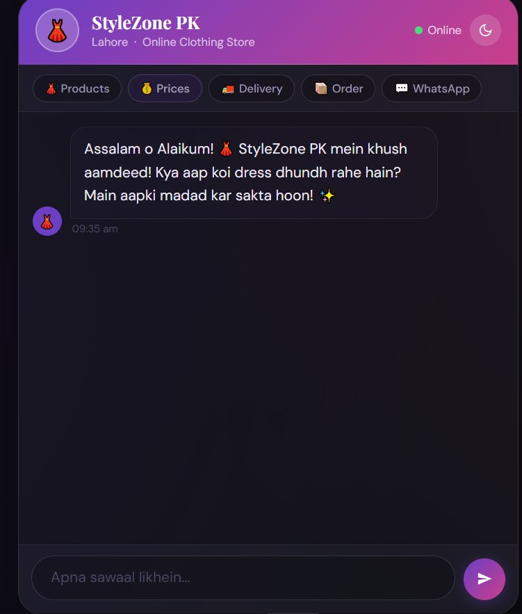

# 👗 StyleZone PK — AI Chatbot

A full-stack AI-powered chatbot for an online clothing store, built with Python (Flask) and Groq API using LLaMA 3.3 70B model.

## ✨ Features

- 🤖 AI-powered responses using LLaMA 3.3 70B via Groq API
- 🌐 Bilingual support — English & Roman Urdu
- ⚡ Real-time responses with typing indicator
- 🎨 Beautiful Purple/Pink gradient UI with Dark/Light theme
- 📱 Responsive design — works on mobile too
- 🛍️ Quick chips for Products, Prices, Delivery, Order, WhatsApp

## 🛠️ Tech Stack

- **Backend:** Python, Flask, Flask-CORS
- **AI Model:** LLaMA 3.3 70B (via Groq API)
- **Frontend:** HTML, CSS, JavaScript
- **Other:** Prompt Engineering, REST API

## 🚀 How to Run

**1. Clone the repository:**
```bash
git clone https://github.com/Rabia-Raz/AI-Projects-Journey.git
cd AI-Projects-Journey/stylezone-pk-chatbot
```

**2. Install dependencies:**
```bash
pip install -r requirements.txt
```

**3. Setup API Key:**
```bash
cp .env.example .env
# .env mein apni Groq API key daalo
```

**4. Run the app:**
```bash
python app.py
```

**5. Browser mein kholo:**
```
http://localhost:5001
```

## 📸 Preview



## 👩‍💻 Built By

**Rabia Raz** — BS Artificial Intelligence Student  
Khawaja Fareed University of Engineering and Information Technology

[](https://www.linkedin.com/in/rabia-raz-ai)
